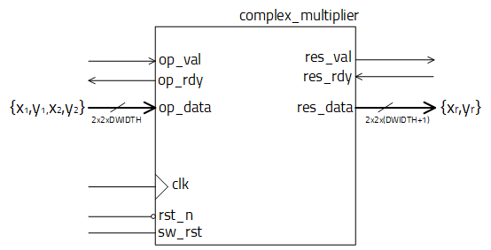
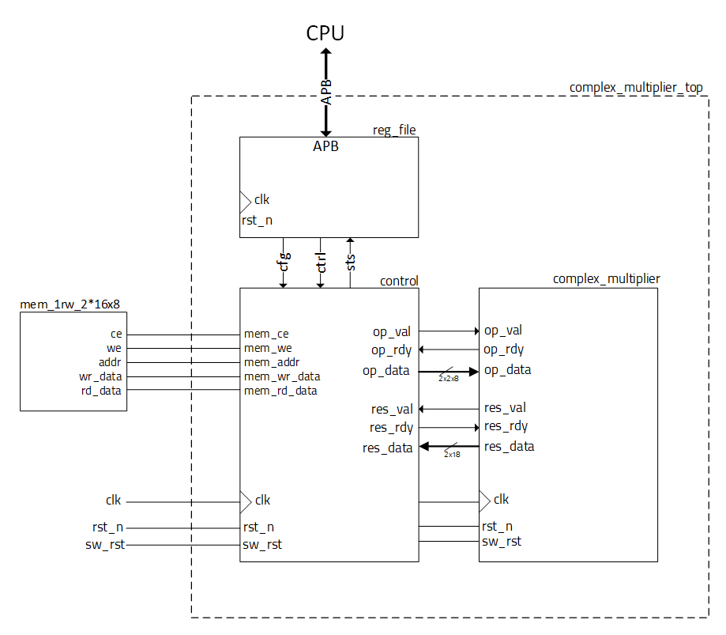

# complex_multiplier
Verilog complex multiplier

This design multiplies 2 complex numbers (algebraic form: x + i \* y)
Each number's real and imaginary part are represented as signed integers with parametrisable width.

With:
  - z1 = x1 + i \* y1
  - z2 = x2 + i \* y2

It computes the output's real and imaginary parts using: 
  - xr = x1 \* x2 - y1 \* y2
  - yr = x1 \* y2 + x2 \* y1

Where the output complex number is: zr = xr + i \* yr.

## Complex multiplier block 

Used as the comp_mult_wrapper.v

- Synchronous system, works on 1 clock domain, rising edge
- Asynchronous reset, active low (rst_n)
- Synchronous soft reset, active high (sw_rst)

It features 2 parameters:
  - DWIDTH - the width in bits of one operand part (input totals to 4 x DWIDTH)
  - NO_MULT - number of internal unsigned multiplier instances (1, 2 or 4) as tradeoff between performance and chip area. 

## Top level implementation 

System implementation featuring a set of registers accesible via the [AMBA APB interface](https://developer.arm.com/documentation/ihi0024/c/Introduction/About-the-APB-protocol) and a single port memory interface with 1 byte/address.

Configuration registers:
  - op1_addr: Base address in memory of the first operands stored as {x1, y1} (little endian). 
  - op2_addr: Base address in memory of the first operands stored as {x2, y2} (little endian).
  - res_addr: Base address in memory of the result written as 6 bytes (with filled bits where needed).
  - no_op: Number of total multiplications (addresses will go up).
  - cfg_start: Write the lowest bit: 'hx..x1 to start the process. Will auto clear.

Status registers:
  - sts_stop: Lowest bit will set 'hx..x1 when the process is finished. 
  - sts_status: Returns the current state of the system control (use for troubleshooting):
    - 'hx..x0 - system is IDLE, waiting for start bit 
    - 'hx..x1 - fetching operands from memory  
    - 'hx..x2 - multiplying
    - 'hx..x3 - writing result

